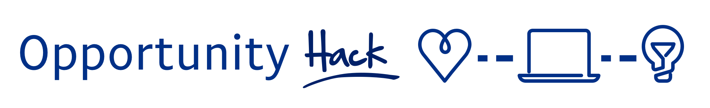

:::warning
This is currently a work in progress.  I'm just getting it into Docusaurus, so it's a hot mess.  As a result this page and the right/left indices are probably inconsistent.  I'll be working to bring those into alignment.
:::

:::tip
If you're reading this in the [Github repo](https://github.com/opportunity-hack/Runbook) it is now more accessible via a [Github Pages](https://opportunity-hack.github.io/Runbook/docs/)
:::

This is my first pass at creating a runbook of my/our thoughts on how to run Opportunity Hack.  There are a few caveats:
* Opportunity Hack has been run in a few different formats.  This runbook focuses on the full weekend varieties run in the US.  
* Even though we've gotten pretty good at these, there is always room for improvement, and we tune things every year.
  * Tuning is is not completely re-examining.

## Hackathon Planning
  * [Budget](budget.md)
  * [Prizes](prizes.md)
  * [Venue](venue.md)
  * [Food](food.md)
  * [SWAG](SWAG.md)
  * Bribes 
### 6+ months
  * [Coordination platform](devpost.md) - ([Devpost](https://www.devpost.com))
  * Recruiting 
    * Hackers
    * Hackees (i.e. NPOs)
    * Sponsors
### 2+ months
  * [Mentors](mentors.md)
  * [Volunteers](volunteers.md)
  * Judges
  * [SWAG](SWAG.md)
    * Give aways
    * T-shirts
### 1+ month
  * Food
  * Recruiting "roadshows"
## Hackathon "weekend" 
### Saturday
  * Registration
  * Breakfast
  * Opening comments
  * Keynote
  * Information for the day
  * NPO presentations
  * Team formation
    * Hacking begins
    * Github repos
    * Devpost submissions
  * A bunch of meals and other stuff 
### Sunday
  * More meals
  * Get submissions done
  * Teams prepping for presentations
  * [Judging](judging.md)
    * [Prepping the judges](prepping-judges.md)
  * Awards
  * Drinking
