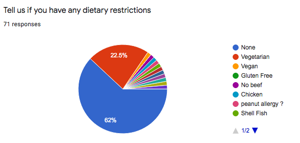
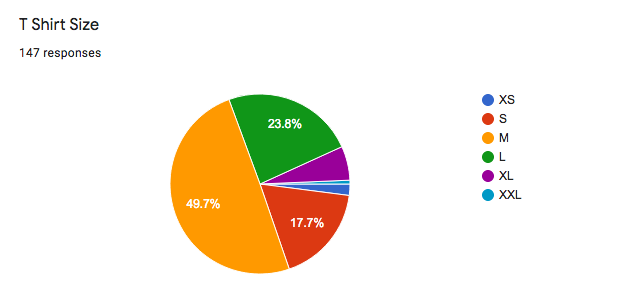
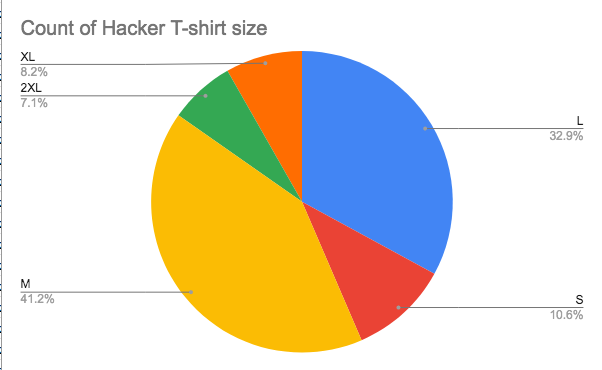

# Resources

A single place to consolidate the various resources to help you run the hackathon.  

# Hackathon Template Files

You should have view access to these, but you'll probably need to make copies for when you run the hackathon. 

*  [Master Presentation](https://docs.google.com/presentation/d/1caHNWUscXTxOiWXHcbPlxWsGHMhDurxgRdG8dau62-8/edit?usp=sharing)
*  [Master Spreadsheet](https://docs.google.com/spreadsheets/d/1UA896TJE1BFBNs3cf81oUJY0YodGAbyKZxQAMRJs9RI/edit?usp=sharing)
*  **Put in a generic marketing agreement form for people to leverage**
*  **Put in some boilerplate rules as well**

## Forms

We tend to use Google Forms for several of the processes, because it makes our lives easier.  But, [giving you access to forms so that you can have your own copies is convoluted](https://alicekeeler.com/2017/01/02/5-steps-sharing-copy-google-form/), so there are a couple of steps.

*  Click on the form
  * Click on "Make a copy"

*  [Copy of the Registration Form](https://docs.google.com/forms/d/1bGVlrfjH-J9HE6WzSUBGzj-EOrlbnvK96Qnd9qP22W4/edit)
*  [Copy of the NPO Registration-Up Form](https://docs.google.com/forms/d/10ihlbE_6RKwg9mXpNfRVnM8AzZIhgoarJajl_j5jxcE/copy)

# Food

Here are the survey results from two years.  As you can see, there is a decent amount of regional variation.  If I were to generalize it would probably be something like:

* Plan for 33% vegetarian
* Plan for a handful of vegan
* Otherwise, the remainder is so small as to not be plannable

## 2019

* Arizona

* California

# Shirts

* Calfornia

* Arizona

**Note:** I wouldn't trust those non-hacker numbers.  There were too few for the total number of mentors/volunteers/judges we had.  I just provide this here so there is __some__ data.

